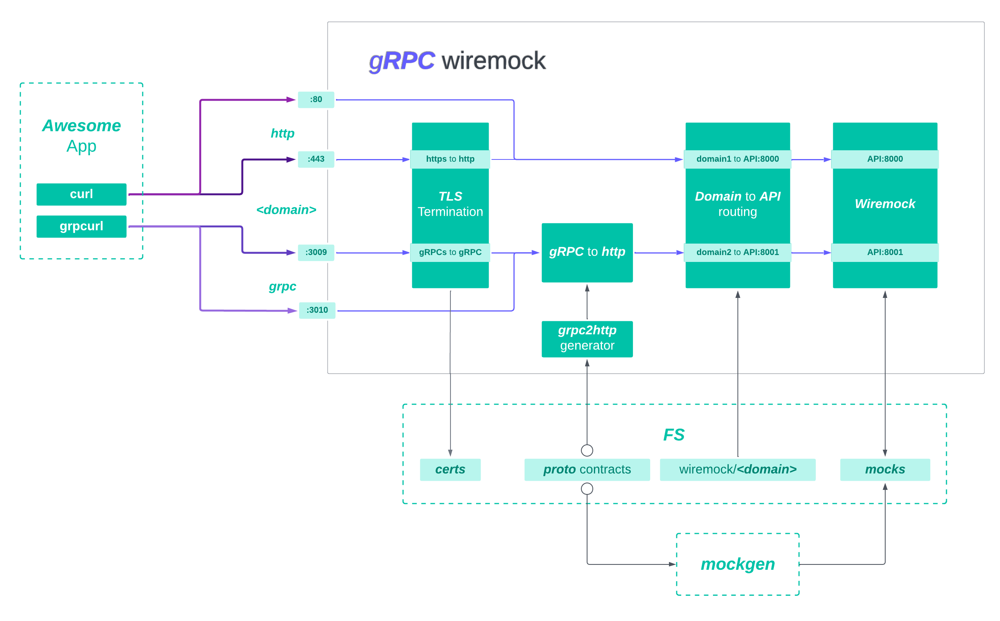

# grpc-wiremock

[Wiremock](https://wiremock.org/docs) is a great way to test your connected services.
But it has one drawback. And that is support for **proto** contracts.

**grpc-wiremock** is designed to solve this problem,
and also provide a handy *tool for generating mocks*. And their *automatic reloading*. 

[Here](docs/comparsion.md) you can compare the functionality with existing solutions.

## Getting started

### Quick start
Check out our [wearable](https://github.com/nktch1/wearable) repo 
with an example service. 

There you will find how the service interacts with the mock and 
a docker-compose file for quick startup.

### Interface

```bash
MOCKS_PATH="$(PWD)/test/wiremock"
CERTS_PATH="$(PWD)/certs"
CONTRACTS_PATH="$(PWD)/deps"
WIREMOCK_GUI_PORT=9000

# grpc-wiremock supports multiple APIs simultaneously.
# This means that the another APIs will go up
# on port 8001, 8002, etc.

YOUR_MOCK_API=8000  

docker run \
  -p ${WIREMOCK_GUI_PORT}:${WIREMOCK_GUI_PORT} \
  -p ${YOUR_MOCK_API}:${YOUR_MOCK_API} \
  -v ${MOCKS_PATH}:/home/mock \
  -v ${CERTS_PATH}:/etc/ssl/mock/share \
  -v ${CONTRACTS_PATH}:/proto \
  SberMarket-Tech/grpc-wiremock@latest
```
## Overview

In general, **grpc-wiremock** contains two main components. 

You can read more about each of them here:
- [mocks generator](docs/mocks.md);
- [grpc-to-http-proxy generator](docs/proxy.md).

In the diagram you can see how your requests are distributed within the **grpc-wiremock** container.



### Benchmarks
You can also read about performance with multiple mock APIs [here](docs/benchmarks.md).

# For developers

## Dockerfile development
To develop `Dockerfile` run `./dev/watch_build_image.sh`.
It will monitor changes you'are adding to `Dockerfile` and rebuild local image
with tag `docker.io/sbermarkettech/grpc-wiremock:dev`.

## Golang code development
To develop golang code

1. Build `Dockerfile` once - run command:

    ```
    ./dev/build_image.sh
    ```
2. Start docker container based on the built image:

    ```
    make -C ./dev/example/ compose-up compose-logs
    ```
3. Log into docker container:

    ```
    make -C ./dev/example/ compose-exec
    ```
4. Change `dev/watch_wiremock.sh` for your needs,  
    i.e. set `-build` command to rebuild and install grpc2http:

    ```
    CompileDaemon -color -log-prefix \
        -build='make install -C cmd/grpc2http' \
        -command='bash ./dev/init_wiremock.sh'
    ```
5. Run `./dev/watch_wiremock.sh`  inside docker container  
    When you change code it will restart wiremock to new version of code

6. Make a request to wiremock:

    ```
    grpcurl -H 'TestHeader: check' \
        -insecure --authority  push-sender \
        -d '{"uuid": "1234", "message": "foo"}' \
        127.0.0.1:3009 push_sender.PushSender/Notify
    ```
## Release process
To release new version

1. Create [new release on github](https://github.com/SberMarket-Tech/grpc-wiremock/releases/new) in semver format, i. e. `v1.1.4`.
2. [GitHub actions](https://github.com/SberMarket-Tech/grpc-wiremock/actions) will build docker image and upload it to [DockerHub SberMarket-Tech grpc-wiremock](https://hub.docker.com/r/sbermarkettech/grpc-wiremock).

### License
**grpc-wiremock** is under the Apache License, Version 2.0. See the LICENSE file for details.
