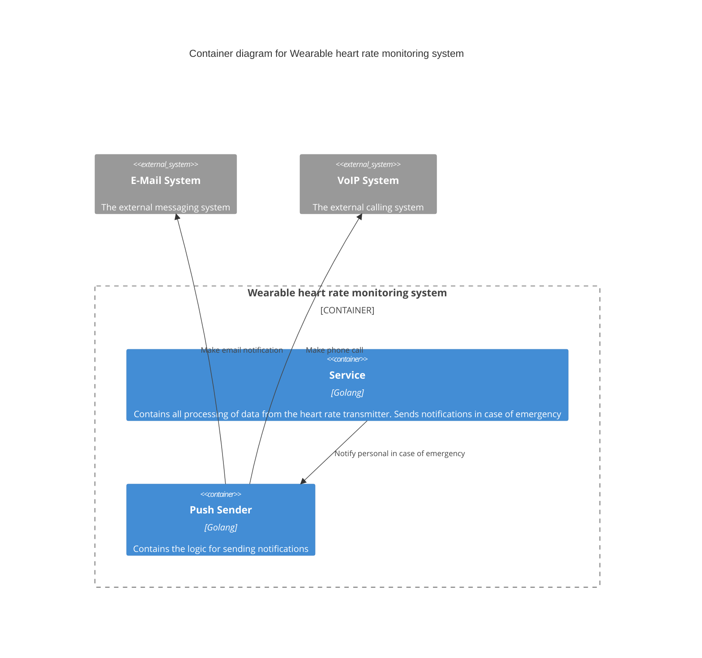
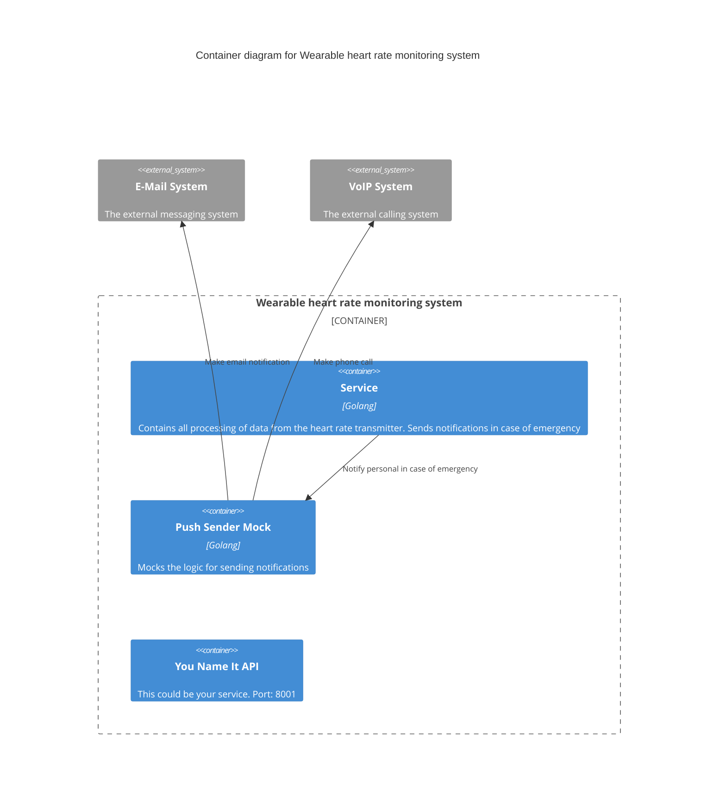

## Overview

To make it easier to understand, let's take a simplified description of 
a cardiac health monitoring system.

### Diagram
Let's have a look at the diagram and move on to the practical part.



### Usecase

The ```Wearable``` service monitors the patient's cardiac health
and notifies the staff in case of an emergency .

Let's pretend that we need to develop a ```Wearable``` service.

In that case, we probably want to disable sending messages to real
notification systems for the time of development and debugging.
To do this, we can run mock service instead of the ```push-sender``` service.

The ```grpc-wiremock``` will do this job just fine. Here is a step-by-step tutorial.

## Hands-on
All you need is ~~love~~ set of **openapi** or **proto** contracts.

### Contracts

#### Wearable

```protobuf
...

service WearableService {
  rpc BeatsPerMinute(BeatsPerMinuteRequest) 
      returns (stream BeatsPerMinuteResponse);
}
```
Check out [wearable.proto](api/grpc/wearable.proto).

#### push-sender

```protobuf
...

service PushSender {
  rpc Notify(NotifyRequest) returns (NotifyResponse);
}
```

Check out [push-sender.proto](api/grpc/push-sender.proto).


### Before run

To run ```grpc-wiremock```, you need to prepare three directories:

- path to the folder with the service-dependency contracts; The directory structure must contain
  folders that match the name of the dependency domains. Each directory with a domain can contain **proto** and **openapi** contracts.
  They must be placed in the **grpc** and **openapi** directories respectively.

    ```
    deps
    └── services
      └── push-sender
          └── grpc
              └── push-sender.proto
    ```
- path to the directory for Wiremock config and mappings (can be empty);
  ```
  test/wiremock
  ```
- path to the directory for generated certificates. For example:
  ```
  certs
  ```

Don't forget to look at the [After run](#after-run) section.

### Run

Execute the folowing command in your console to start the ```grpc-wiremock```:
```bash
MOCKS_PATH="$(PWD)/test/wiremock"

CERTS_PATH="$(PWD)/certs"

CONTRACTS_PATH="$(PWD)/deps"

docker run \
  -it --rm --name grpc-wiremock \
  -p 9000:9000 \
  -p 8000:8000 \
  -p 80:80 \
  -v ${MOCKS_PATH}:/home/mock \
  -v ${CERTS_PATH}:/etc/ssl/mock/share \
  -v ${CONTRACTS_PATH}:/contracts \
  sbermarkettech/grpc-wiremock:latest
```

You can also run services using ```docker compose```. 

Check out [compose](build/docker-compose.yaml) file. And a [makefile](Makefile).

```bash
make up
```

### After run
Let's check the ```grpc-wiremock``` container.
```bash
docker logs wearable-mock | tail -n 15
```

```
gw.wiremock.run: ██     ██ ██ ██████  ███████ ███    ███  ██████   ██████ ██   ██ 
gw.wiremock.run: ██     ██ ██ ██   ██ ██      ████  ████ ██    ██ ██      ██  ██  
gw.wiremock.run: ██  █  ██ ██ ██████  █████   ██ ████ ██ ██    ██ ██      █████   
gw.wiremock.run: ██ ███ ██ ██ ██   ██ ██      ██  ██  ██ ██    ██ ██      ██  ██  
gw.wiremock.run:  ███ ███  ██ ██   ██ ███████ ██      ██  ██████   ██████ ██   ██ 
gw.wiremock.run:                    ___         __  _____  ___ 
gw.wiremock.run:                   / _ )__ __  / / / / _ \/ _ \
gw.wiremock.run:                  / _  / // / / /_/ / ___/\_, /
gw.wiremock.run:                 /____/\_, /  \____/_/   /___/ 
gw.wiremock.run:                      /___/                    
gw.wiremock.run: Build ok.
gw.wiremock.run: Restarting the given command.
gw.wiremock.run: Starting listening on :3010
gw.wiremock.run: Listening on :3010
```

You can see that ```Wiremock``` itself started successfully
and also the grpc-proxy server on :3010 is running.

Other than that:
- you got generated certificates to test with secured connection:
  ```
  certs/
  ├── mockCA.crt
  ├── mockCA.key
  └── mockCA.srl
  ```

  - ```test/wiremock``` directory looks like this:
    ```
    test/wiremock
    └── push-sender
              ├── __files
              └── mappings
    ```

### Wiremock APIs

```grpc-wiremock``` allows you to mock several APIs simultaneously. 
It uses [Supervisord](https://github.com/ochinchina/supervisord) to start several Wiremock processes under the hood.

To add/delete API instance:
- add/delete directory <dependency-name> in ```test/wiremock```
- call ```docker exec wearable-mock reload``` to apply changes 

Just to let you visualize it:



## How to try

```Wiremock``` can make it easier to develop and test connected services.
By replacing the actual service API with a mock.

And with ```grpc-wiremock``` you got support for **proto** contracts.

You have the following:
- the mocks are generated automatically, you can change them 
and ```grpc-wiremock``` will notice this and reload the mocks for you (**COMING SOON**);
- you don't need to know which port Wiremock allocated for the ```push-sender```.

To run services: ```make compose-run```.

You can access the ```push-sender``` API like this:

#### from ```wearable``` container:
  - you can access gRPC handler:
    ```bash
    grpcurl \
        -d '{"uuid": "1234", "message": "foo"}' \
        --authority "push-sender" --plaintext \
        wearable-mock:3010 push_sender.PushSender/Notify 
    {
        "status": 425895108
    }
    ```
  - direct request to Wiremock API:
    ```bash
    curl -XPOST wearable-mock:8000/PushSender/Notify
    {
      "status" : 425895108
    }
    ```
  - request to reverse proxy server (need to specify name of dependency):
    ```bash
    curl -XPOST --header "Host: push-sender" wearable-mock/PushSender/Notify
    {
        "status" : 425895108
    }
    ```

#### from host:
- install certificates:
    ```bash
    sudo security add-trusted-cert -d -r trustRoot -k /Library/Keychains/System.keychain $(pwd)/certs/mockCA.crt 
    ```
  
- you can simplify access to the endpoints by adding new lines to ```/etc/hosts```:
    ```bash
    echo '127.0.0.1 push-sender' | sudo tee -a "/etc/hosts"
    ```
- after updating ```/etc/hosts``` file, you can access endpoints like this:
    ```bash
    grpcurl \
      -d '{"uuid": "1234", "message": "foo"}' --plaintext \
      push-sender:3010 push_sender.PushSender/Notify
    ```

This is all well and good, but we absolutely need to 
get the status ```1126``` after sending the notification.
  
Let's change this value in [pushsender_notify_post_200.json](test/wiremock/push-sender/mappings/):
  ```json
  {
    ...
    
    "request" : {
      "urlPath" : "/PushSender/Notify",
      "method" : "POST"
    },
    "response" : {
      "status" : 200,
      "body" : "{\n  \"status\" : 1126\n}",
      "headers" : {
        "Content-Type" : "application/json"
      }
    }
  }
  ```

*How much fine-tuning of the mocks can be done, 
see [here](https://wiremock.org/docs/stubbing).*

Check the ```wearable-mock``` logs:
```bash
docker logs wearable-mock | grep wiremock.mappings
```
```
wiremock.mappings: Upload mappings for push-sender ... OK
```

As you may have guessed, the second 
request will give us our target status:

```bash
grpcurl \
    -d '{"uuid": "1234", "message": "foo"}' \
    --authority "push-sender" --plaintext \
    wearable-mock:3010 push_sender.PushSender/Notify 
{
    "status": 1126
}
```

### The tricky parts
The header ```Host``` in the http request and ```authority``` for gRPC
are used for authentication and routing.

Example NGINX config for a Wearable system:

```
cat /etc/nginx/http.d/mock-push-sender.conf 

server {
    server_name  push-sender push-sender.*;

    listen      80;
    listen [::]:80;
    listen 443 ssl;

    ssl_certificate /etc/ssl/mock/mock.crt;
    ssl_certificate_key /etc/ssl/mock/mock.key;

    access_log  /var/log/nginx/push-sender.access.log  main;

    location / {
        proxy_set_header Host $host;
        proxy_set_header X-Real-IP $remote_addr;
        proxy_pass http://localhost:8000;
    }
}
```

If a request is sent without the ```authority``` flag, 
the following will appear in the ```wearable-mock``` logs:

```
gw.routing.nginx.logs: warn: domain "wearable-mock" is not mocked - [23/Jan/2023:05:35:40 +0000] 127.0.0.1 "Go-http-client/1.1" "POST /PushSender/Notify HTTP/1.1" 
```

This means that the proxy server could not decide without a special 
header where to redirect your request to.
